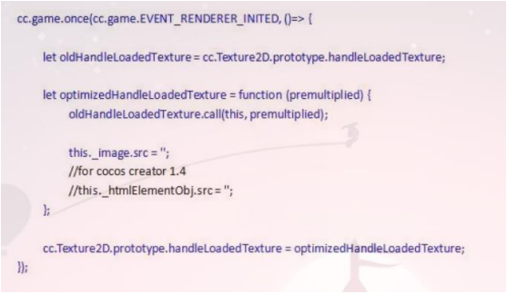

# CocosCreator 内存与性能优化

## 一、内存优化

* 因为 iOS 小游戏和微信共用同一个进程，而微信在连续两次收到系统内存警告的时候会关闭小游戏并释放小游戏占用的内存。  
* 如果你的小游戏有外网用户反馈“闪退”，或者你自己测试的时候频繁出现“该小程序可能导致微信响应变慢被终止”等提示，那么就应该是时候优化你的小游戏内存了！

**1 、优化双份纹理（必做！）**

* 在你的项目中添加如下代码，就可以减少大量内存：  
  
* 这里面的原理是，当 Creator 使用 DOM 的 Image 对象去加载一个图片资源的时候，微信底层的引擎会解码图片数据，同时往 GPU 上传一份纹理，然后引擎的 Sprite 在渲染的时候会使用这个 DOM Image 再生成一份 GPU 纹理并上传，导致 GPU 里面存在双份纹理。使用 `Image.scr = ''` 可以释放掉 GPU 里面多出来的一份纹理，同时也会释放 CPU 端解码的纹理内存。所以，基本上对 Image 对象调用了 `src = ''` 这个操作，这个 Image 对象占用的内存就释放干净了。  
* 之前尝试使用 DOM Image pool ，当一个图片资源解码成功并且上传 GPU 以后，把这个 Image 对象的 src 置空后放入池子，然后重复利用。不过对比了一下内存占用，感觉 `src = ''` 之后内存立即就释放了，优化作用并不是很明显。

**2 、优化图集**

* 最好对所有的碎图资源进行图集合并（ Creator 自带一个自动图集合并工具），并且最大限度填满图集，不要留有太多空白。图集的大小尽可能限制在 1024*1024 以下，因为有些图片有不少透明像素，合并图集的时候可以 trim 掉这些透明像素。另外合图还可以优化 Drawcall ，减少图片读取和解码操作，对性能也有一定优化。  
* 另外，对于显示效果要求不高的界面，可以适当降低图片的尺寸。

**3 、优化 Label**

* Creator1.9.3 之前的版本，每创建一个系统字体就会生成一个离屏的 Canvas 对象，然后保存这个 Canvas 对象的 context ，每次 draw 一个系统字体的时候会调用这个 context 的 fillText方法生成一张纹理并渲染。 1.9.3 以后我提交了一个优化，所有的系统字体渲染共享一个离屏 Canvas ，这样大概可以优化 30M 左右的内存（不同的项目效果不一样）。  
* 老引擎参考 PR 地址：`optimization label memory #2693 fix label rendering issue #2880 （这个 PR 主要是 Bug 修复）`

**4 、优化资源释放**  

* 对于二级弹框和场景资源释放，可以使用 cc.loader.release 接口配合场景的“自动释放”属性来实现。  
* 对于一个二级面板，我们可以约定这个二级面板引用的资源范围。我们把游戏中共用的资源放到 Common 图集中，把每个二级面板的资源放到自己的图集中。当释放资源的时候，我们可以通过 `cc.loader.getDependsRecursively( 'prefab url' )` API 拿到面板 Prefab 所引用的所有资源，然后对这个返回的资源数组做资源释放。  
* 比如，在我们的项目里面，释放资源的时候，我排除了 Common ， Main ， Game/FX 目录下面的图集资源：  
  
* 场景的资源释放只需要勾选一个属性就可以了：  
  

## 二、性能优化

* 目前小游戏的性能瓶颈大多在 JS 层面，可以使用 Chrome 先去 profiles 性能热点，然后针对性地去做优化。
* 这里给出几点优化建议：  
**1 、游戏中频繁更新的文字，推荐使用 BMFont ，系统字体会比较消耗性能。**  
**2 、优化 Drawcall ，尽可能减少 Drawcall 数量。**  
**3 、减少 Mask 组件的使用，该组件会导致游戏中的 Drawcall 数量变多。**  
**4 、禁用引擎的 culling ，禁用方法 cc.macro.ENABLE_CULLING = false 。**  
**5 、如果使用物理引擎，可以把物理引擎的 step 间隔调大。**  
**6 、优化节点树，减少节点数量。**  
**7 、场景中不要挂载过多的 Prefab ，可适当将一些 Prefab 变成动态加载的。**  

## 三、包体优化

* 因为微信小游戏对于包体有 4M 的限制，最近才刚开始升到 8M ，但是必须要分包，而且每一个分包的大小还是不能超过 4M 。  
* 下面给出一些优化建议：  
**1 、首包中不要包含过多的资源，如果一定要包含，请务必压缩。对于背景图片可以使用 JPG ， PNG 图片可以使用 png8 进行压缩。**  
**2 、代码必须使用 `uglify` 进行压缩，尤其是第三方库，游戏代码如果使用 release 构建引擎有 做 `uglify` 。如果想进一步压缩代码体积，需要考虑使用 `Google Closure Compiler` 进行高级压缩。**  
**3 、不需要动态加载的图片资源不要放到 resources 目录，放到此目录的资源在构建导出的时候，会生成资源映射关系到 Settings.js 中，会导致该 Settings.js 文件变大。另外为了防止缓存问题，需要使用 md5 ，此时 Settings.js 文件会进一步膨胀。过气的活动 Prefab 也可以移出 resources 目录，所以定期资源清理也是必要的。**  
**4 、 Settings.js 文件优化，可以自己写脚本把 md5Map 里面的 rawAssets 的 md5 映射存到原本的 rawAssets 中，然后在 boot.js 里面还原 md5Map 即可。优化之后的 Settings.js 长这个样子：**  
  
**boot.js 里面还原 md5AssetMap 的的代码：**  
  
**5 、一定要使用 release 模式构建，这种方式构建出来的 json 资源会压缩， Settings.js 也会优化。**  
**6 、对于引擎不使用的模块进行裁剪，这个可以减少引擎大小**