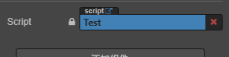
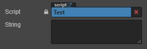
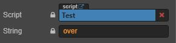
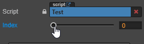

# Cocos Creator

## 综合
**替换服务器上资源一定要记得备份**
* 遇事不决先保存
* 一个需求完成后，先提交一次再继续做别的需求
* 废弃代码及时清理
* 空闲的时候看以前写的代码是否可以优化  
* 资源文件 ( 图片,预制体等 ) 名称不要有特殊符号和中文,可能会有问题  
* Cocos Creator 搭建安卓原生环境的时候要注意：Cocos Creator 安装目录和 sdk、ndk、ant 的路径都不能有中文和空格  
* Cocos Creator 编译安卓原生的时候有类似以下报错或找不到文件夹可能是因为项目路径太深  
    `fatal error: opening dependency file ... No such file or directory`
* CocosCreator 中 Java 和 JS 互相调用  
  > [如何在 Android 平台上使用 JavaScript 直接调用 Java 方法](https://docs.cocos.com/creator/manual/zh/advanced-topics/java-reflection.html?h=java)  
  >> _**\(特别注意String的方法签名 `Ljava/lang/String;` 后面的分号一定要加上去\)**_  
* 在 TS 中引用 JS `import js = requrie("./js")`
* 在 JS 中引用 TS `import ts from "./ts";`
* 在资源管理器里删除资源或者手动移动资源后如果有报错，把 `library` `local` `temp` 目录删掉重新打开
* 两个 TS 文件互相引用编辑器会报错
* Git 同步场景可能会因为冲突导致无法解决的报错，这时可以放弃较少修改的部分，同步完后重新修改场景再提交
* `node._touchListener.setSwallowTouches(false);` 可以让去掉点击事件截断，非父子节点也可穿透，使用 `cc.macro.ENABLE_MULTI_TOUCH = false;` 关闭多点触碰，会导致点击事件被其他节点截断，哪怕层级在该节点底下。
* Cocos Creator 默认的摄像机是透视模式的，如果需要用3D节点做倾斜文字，需要将摄像机设置为正交摄像机，不然因为透视会导致每个3D节点显示的角度不一样。
* `CCLabel` 的 `string` 修改后节点大小会在下一帧才刷新，2.2版本前可以使用 `label._updateRenderData()` 来手动刷新节点大小，之后可以使用 `label._forceUpdateRenderData()` 来刷新。刷新后获取节点大小就是修改内容后正确的大小
* ~~`cc.audioEngine.setFinishCallback(id, null);`~~//设置完成回调函数不能写null，会导致原生平台报错
* Spine 骨骼动画可以在不同轨道播放动画来实现动画混合效果，轨道动画播放完之后需要清除轨道动画，否则动画会一直覆盖在上面。使用 `setTrackCompleteListener` 来监听动画是否播放完毕， `setTrackEndListener` 监听到后 `clearTrack` 无效。
### CCClass 中属性 `property` 属性参数
* `type` 限定属性的数据类型
  ```Typescript
    @property({ type: cc.Node })
    test: cc.Node = null;
    //or
    @property(cc.Node)
    test: cc.Node = null;
  ```  
    
* `visible` 在 **属性性检查器** 中显示或隐藏
  ```Typescript
    isShow: boolean = false;
    @property({ type: cc.Node, visible() { return this.isShow; } })
    test: cc.Node = null;
  ```  
    
* `displayName` 在 **属性检查器** 中显示为另一个名字
  ```Typescript
    @property({ type: cc.Node, displayName: "节点" })
    test: cc.Node = null;
  ```  
    
* `tooltip` 在 **属性检查器** 中添加属性的 Tooltip，将鼠标悬浮于属性上会出现对应的字符串
  ```Typescript
    @property({ type: cc.Node, tooltip: "这是一个节点" })
    test: cc.Node = null;
  ```  
    
* `multiline` 在 **属性检查器** 中使用多行文本框
  ```Typescript    
    @property({ multiline: true })
    private string: string = "";
  ```  
    
* `readonly` 在 **属性检查器** 中只读
  ```Typescript
    @property({ readonly: true })
    private string: string = "over";
  ```  
    
* `min` 限定数值在编辑器中输入的最小值
  ```Typescript
    @property({ min: 0 })
    private index: number = 0;
  ```  
    
* `max` 限定数值在编辑器中输入的最大值
  ```Typescript
    @property({ max: 1 })
    private index: number = 0;
  ```  
    
* `step` 指定数值在编辑器中调节的步长
  ```Typescript
    @property({ step: 1 })
    private index: number = 0;
  ```  
    
* `range`	一次性设置 `min`, `max`, `step`
  ```Typescript
    @property({ range: [0, 1, 1] })
    private index: number = 0;
  ```  
* `slide` 在 **属性检查器** 中显示为滑动条，需要设置 `max` 及 `min`， `step` 无效
  ```Typescript
    @property({ slide: true, min: 0, max: 10, step: 1 })
    private index: number = 0;
  ```  
    
* `serializable` 序列化该属性，指定了 `default` 默认值的属性默认情况下都会被序列化，序列化后就会将编辑器中设置好的值保存到场景等资源文件中，并且在加载场景时自动还原之前设置好的值
  ```Typescript
    @property({ serializable: true })
    private index: number = 0;
  ```  
* `formerlySerializedAs` 指定之前序列化所用的字段名，重命名属性时，声明这个参数来兼容之前序列化的数据
* `editorOnly` 在导出项目前剔除该属性
* `default` 定义属性的默认值
  ```Typescript
    //ts
    @property({type: cc.Node})
    private test: cc.Node = null;
    //js
    test: {
      default: null,
      type: cc.Node
    }
  ```  
* `notify` 当属性被赋值时触发指定方法，用法同 `visible` 需要定义 `default` 属性并且不能用于数组，也不支持 `ES6` 定义方式  
* `override` 当重写父类属性时需要定义该参数为 true
* `animatable` 该属性是否能被 **动画编辑器** 修改，设置为 `true` 后该属性可以在动画编辑器中添加动画
* 定义 `get/set` 方法，设置 `get` 后，属性无法被序列化，也无法设置默认值
  ```Typescript
    //ts
    private _color: cc.Color = cc.Color.WHITE;
    @property({ type: cc.Color })
    get color() {
        return this._color;
    }
    set color(color: cc.Color) {
        this._color = color;
    }
    //js
    color: {
        default: cc.Color.WHITE,
        type: cc.Color
        get: function () {
          return this._color;
        },
        set: function (value) {
          this._color = value;
        }
    },
  ```

### AsseBundle
* 2.4.x 版本的 `cc.assetManager.loadRemote` 远程下载单个文件可以通过在 `options` 中添加 `{onFileProgress:(loaded, total) => {} }` 来获取下载进度。但是因为下载远程文件用的 `XMLHttpRequest` 所以需要服务器添加对应设置才可以获取。如果没有办法添加则可以继续使用 `cc.loader.load` 来加载远程资源，截至2.4.3该API还没有移除。  
* 2.4.x 版本的 `cc.assetManager.loadBundle` 只会加载 Bundle 的配置文件，加载完毕会返回一个 Bundle 对象，可以通过这个对象来加载 Bundle 内的资源:
  ```typescript
  //cc.Asset 为指定类型，如果加载文件夹，将会只返回指定类型的资源
  bundle.loadDir(assetUrl, cc.Asset, (finish: number, total: number) => {
    }, (error: Error, asset: cc.Asset) => {
    });
  bundle.load(assetUrl, cc.Asset, (finish: number, total: number) => {
    }, (error: Error, asset: cc.Asset) => {
    });
  ```
* `cc.assetManager.loadBundle` 可以加载本地 Bundle 也就是说开发时可以直接构建然后加载 build 出来的 AssetBundle 包进行测试
* 加载目录下所有资源会包含子目录，且加载目录下所有资源时，若指定了资源类型，则只会加载该类型的资源
* AssetBundle 可以包含代码，但是TS使用时不可以引用 Bundle 包里面的类，需要使用 `node.getComponent('className');` 的方式来获取 Component
* AssetBundle 的版本号就是打包出来之后中间的这段字符串 `config.版本号.json` `index.版本号.js` 若勾选md5，则会自动添加md5字符串，也可以手动填写，如 `index.1.0.js` 加载时版本号填写 `{ver: '1.0'}` 即可  
* 可以通过以下代码获取bundle中所有资源路径，且不需要加载资源  
  ```typescript
  //_config为私有属性，不推荐使用，但当前官方并未提供获取api
  let map = bundle._config.paths._map;
  let tmpArr = [];
  for (var item in map) {
      tmpArr.push(item);
  }
  console.log(tmpArr);//["path1","path2","path3/path"];
  ```
* AssetBundle 使用 `loadDir` 加载文件夹时，如果文件夹下有子文件夹，会导致进度回调中的 `total` 字段随着加载增加，可能会出现 `finish/total` 获取的进度不准确
  
### Shader
[OpenGL ES](https://www.jianshu.com/p/99daa25b4573)  
[Learn OpenGL CN](https://learnopengl-cn.github.io/)  
* 大致流程  
  1. 获取图像数据流
  2. `顶点处理` 根据投影等矩阵变换改变顶点位置，并根据顶点位置来计算纹理坐标的位置
  3. `图元拼装` 根据处理好的顶点及纹理坐标信息，将纹理组装成图元
  4. `栅格化操作` 根据处理好的图元数据，分解成更小的对应缓冲区像素的片元
  5. `片元处理` 通过纹理坐标取得纹理中相对应的片元像素值,根据自己的业务处理来变换这个片元的颜色
  6. `帧缓冲操作` 将最终的像素值写入帧缓冲区
* `顶点着色器` 是用来**替代** `顶点处理` 阶段的，`片元着色器` 是用来**替代** `片元处理` 阶段的
* Cocos creator Effect 语法使用 `GLES语法(与C语言很相似)`，所以语法学习并不难，难点在于数学  

### 关于插件

* JS 文件可以勾选导入为插件，插件 JS 文件不可用 `ccclass` 类，会在游戏代码前加载，可以用于初始化一些全局变量、方法等

## 关于Tiled Map

* 可以在Tiled Map中新建对象层，使用多边形来设置不规则碰撞箱，在 Cocos Creator 内获得所有多边形的数组来动态生成多边形碰撞：  
  ```typescript
        let objects = map.getObjectGroup("collision").getObjects();//获取对象层内所有对象
        for (let i = 0; i < objects.length; i++) {
            let collider = new cc.Node("collision");
            this.node.addChild(collider);
            collider.setPosition(map.node.position.x + objects[i].x, map.node.position.y + objects[i].y);
            let body = collider.addComponent(cc.RigidBody);
            body.type = cc.RigidBodyType.Static;//设置刚体类型为静态
            body.allowSleep = true;//设置自动休眠为true
            body.gravityScale = 0;//设置受重力影响为0
            body.awakeOnLoad = true;//设置默认唤醒
            let polygon = collider.addComponent(cc.PhysicsPolygonCollider);
            let p = objects[i].points;
            let points: cc.Vec2[] = [];
            for (let i = 0; i < p.length; i++) {
                let v2 = cc.v2(p[i].x, p[i].y);
                points.push(v2);
            }
            polygon.points = points;
            polygon.apply();
        }
  ```

## 关于游戏优化

* 加载场景时会把场景依赖的资源也一起加载，所以尽量不要把所有东西都放在场景内
* 关于内存占用，动态加载预制体也会把预制体依赖的资源一起加载进来，所以要及时释放掉
* 图片纹理占用内存大小是和图片的分辨率大小相关的，与图片本身文件大小无关，所以可以用小图的尽量用小图，能够显著降低该图片的内存占用
* 场景内层级尽量不要太深，否则可能会影响渲染效率
* 同一个界面的东西尽量在同一个层级，并且将同一个界面的图片做成图集，这样 Draw Call 就只会有一次，在 Draw Call 太高的时候可以这样进行优化

  > [游戏性能调优](https://forum.cocos.org/t/topic/95040)  
  > [Cocos Creator 性能优化：DrawCall（全面！）](https://forum.cocos.org/t/cocos-creator-drawcall/95043)  
  > [Cocos Creator 微信小游戏平台启动与包体优化（首屏渲染耗时降低 50%）](https://forum.cocos.org/t/cocos-creator-50/94999)  
  > [自定义渲染合批之自定义顶点格式（附 Demo 和引擎源码解读）](https://forum.cocos.org/t/demo/95087)  
  > [解读 Cocos Creator 引擎：让实例化快 50% 的原理，“拖节点”性能会更好吗？](https://forum.cocos.org/t/cocos-creator-50/92957)  
  > [如何提升JSON.stringify\(\)的性能？](https://segmentfault.com/a/1190000019400854)

## 挺不错的文章

* 还未整理分类

  > [Cocos入门指引](https://forum.cocos.org/t/cocos/94728)  
  > [使用Creator三年的游戏开发总结](https://forum.cocos.org/t/creator/94747)  
  > [\[教程\] \| 物理挖洞/涂抹地形的几种实现讨论 \[大集合整理篇\]](https://forum.cocos.org/t/topic/91985)  
  > [\[教程\]Creator迷宫的生成: DFS与BFS算法实现](https://forum.cocos.org/t/creator-dfs-bfs/93906)  
  > [\[ituuz分享\]探照灯效果shader实现](https://forum.cocos.org/t/ituuz-shader/94180)  
  > [Cocos3D《病毒传播模拟器》游戏版本1 开发日志和总结](https://forum.cocos.org/t/cocos3d-1/94592)  
  > [slg系列（地图篇）3d透视无限地图完成……其他补充中..](https://forum.cocos.org/t/slg-3d/95028)  
  > [slg 细分篇 ——— 无限地图原理](https://forum.cocos.org/t/slg/95269)  
  > [自定义渲染合批之自定义顶点格式（附 Demo 和引擎源码解读）](https://forum.cocos.org/t/demo/95087)  
  > [Cocos Creator 一种「无侵入」资源加密方案](https://forum.cocos.org/t/cocos-creator/95492)  
  > [Cocos Creator 通用框架设计 —— 资源管理](https://forum.cocos.org/t/cocos-creator/84793)  
  > [Cocos Creator 通用框架设计 —— 资源管理优化](https://forum.cocos.org/t/cocos-creator/93517)  
  > [Cocos Creator 水的浮力实现过程](https://forum.cocos.org/t/cocos-creator/96116)  
  > [制作一个可以将小游戏快速接入APP的安卓SDK-开篇](https://forum.cocos.org/t/app-sdk/95810)  
  > [解读 Cocos Creator 引擎：cc.AssetManager（1）重构后的 cc.loader](https://forum.cocos.org/t/cocos-creator-cc-assetmanager-1-cc-loader/92319)  
  > [如何巧用设计图提高UI的还原度](https://forum.cocos.org/t/ui/96354)  
  > [使用CocosCreator模拟书本翻页效果](https://forum.cocos.org/t/cocoscreator/96358)  
  > [Creator web平台setting.js 文件详细解析和资源加载解析](https://forum.cocos.org/t/creator-web-setting-js/78669)  
  > [cocos实现对ETC2的支持](https://forum.cocos.org/t/cocos-etc2/49061)  
  > [避免纹理抖动](https://forum.cocos.org/t/topic/91307/7)  
  > [使用2种方式实现动画的动态蒙版](https://forum.cocos.org/t/topic/96372)