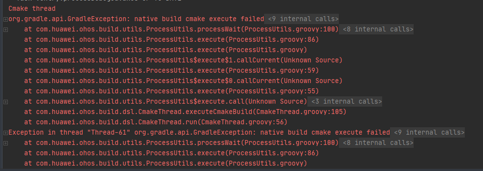
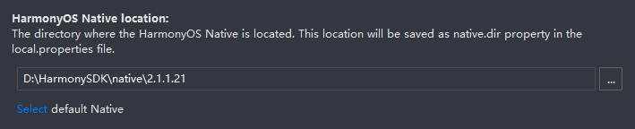

# 鸿蒙开发相关
* [CocosCreator发布流程参考](https://docs.cocos.com/creator/3.3/manual/zh/editor/publish/publish-huawei-ohos.html)  
* [配置应用签名信息](https://developer.harmonyos.com/cn/docs/documentation/doc-guides/ide_debug_device-0000001053822404#section837891802519)

* CocosCreator发布鸿蒙可能遇到的问题
    
    **不要使用最新版的NDK**
    
